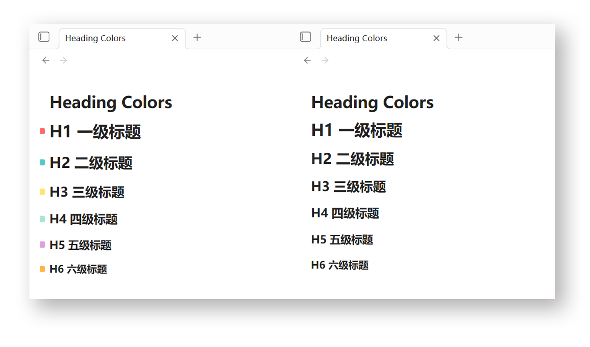

# Heading Colors

A plugin for [Obsidian](https://obsidian.md) that adds colored markers to heading levels (H1-H6), helping you quickly distinguish heading levels at a glance. Supports both Edit mode (Live Preview / Source Mode) and Reading mode.

## Installation

### From Obsidian Community Plugins

1. Open Obsidian → Settings → Community Plugins
2. Disable **Safe Mode** if needed
3. Click **Browse** and search for "Heading Colors"
4. Install and enable the plugin

### Manual Installation

1. Download `main.js`, `styles.css`, and `manifest.json` from the [latest release](https://github.com/ibarv/obsidian_heading-colors/releases/latest)
2. Copy them into your vault's `.obsidian/plugins/heading-colors/` folder
3. Open Obsidian → Settings → Community Plugins → Enable "Heading Colors"

## Custom Configuration

Use the [Style Settings](https://github.com/mgmeyers/obsidian-style-settings) plugin to customize colors, marker sizes, and positions — or edit `styles.css` directly.

### 1. Basic Marker Size

```css
--marker-width: 8px;   /* Marker block width */
--marker-height: 10px; /* Marker block height */
--marker-radius: 2px;  /* Rounded corner radius; set to 0 for right angles */
```

### 2. Position Offset for Edit Mode

```css
--marker-left: -14px;    /* Horizontal offset; negative = left, positive = right */
--marker-vertical: 0px;  /* Vertical offset; positive = down, negative = up */
```

### 3. Exclusive Settings for Reading Mode

```css
--reading-left-adjust: -1px; /* Horizontal compensation to align with Edit Mode */
--show-reading-markers: 1;   /* Toggle: 1 = enabled, 0 = disabled */
```

### 4. Global Heading Line Height

```css
--heading-line-height: 1.37; /* Unified line height for all headings */
```

### 5. Default Color Scheme

| Heading Level | Color Code | Color Name    |
| ------------- | ---------- | ------------- |
| H1            | `#FF6B6B`  | Coral Red     |
| H2            | `#4ECDC4`  | Tiffany Blue  |
| H3            | `#FFE66D`  | Butter Yellow |
| H4            | `#A8E6CF`  | Mint Green    |
| H5            | `#DDA0DD`  | Lavender      |
| H6            | `#FFB347`  | Light Orange  |

## License

MIT
